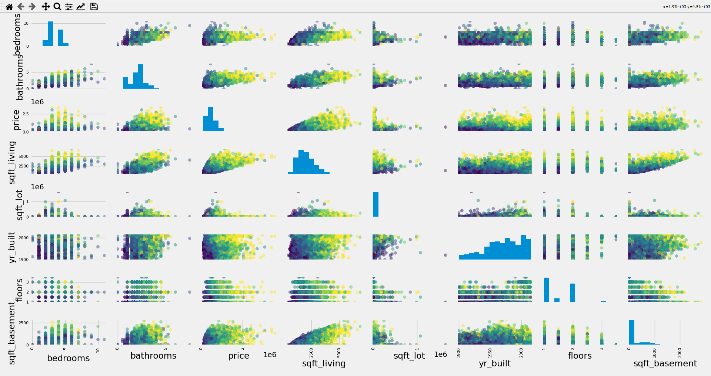
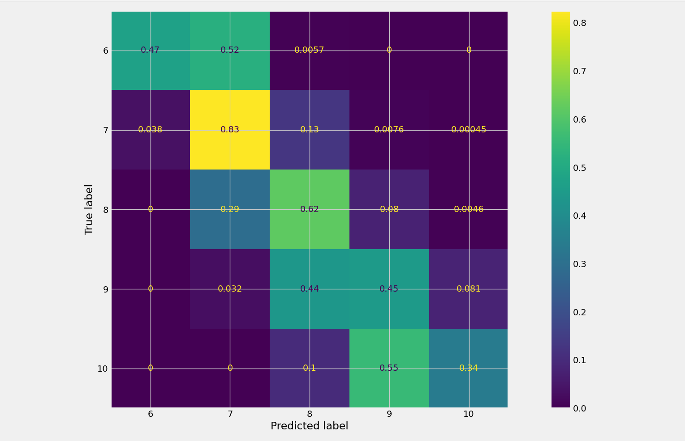
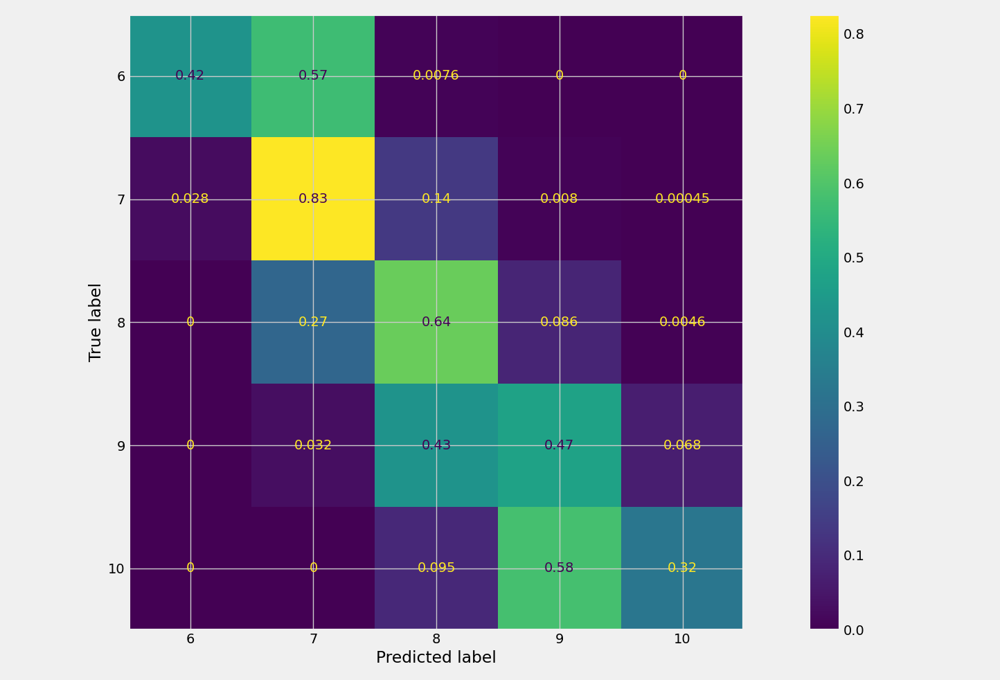

## Machine Learning: Project 2

### Alex Karwowski

### Group 2

---
- [Abstract](#abstract)
- [Introduction](#introduction)
- [Statistical Summary](#statistical-summary)
- [Summary of Classification Results](#summary-of-classification-results)
- [Conclusion](#conclusion)
---

# Abstract

We are trying to predict the grade of a house based on a couple key features of the house like, Price, Sq. Footage, Numbers of Bedrooms and Bathrooms, and more.

We used a housing market data set for Kings County Washingtion. There are over 21,000 entries but we have limited it to around 20,000 since we aren't calculating models for entries above a grade 10, or below a grade 6 since the number of entries for those classifications are less than 5% of the entire dataset but can change our accuracy by upto 10%. The features we decided upon using in our models were:

`Bedrooms, Bathrooms, Price, Sq Footage of the House, Sq Footage of the property, Year Built, Number of Floors, and Sq. Footage of the Basement`

We used a grand total of 6 different learning models:

`Logistic Regression, K Nearest Neighbors, Linear SVC, Polynomial SVC, RBF SVC, and a Linear Kernel version of SVC`

The outcome of all the learning models was around 65% accuracy, which is actually fairly good considering both the size of the dataset and the number of classes we have to go off of is so large.

In general, prediction of an average house, grade 7, was around 83% while a below average grade is about 45%, and above average was around 65%.

---

# Introduction

The problem we are trying to solve with this program is to see if we (using multiple differernt machine learning models) can predict the grade of property. The grade of a house is a number between 1-15, which denotes how well it was constructed as well as the overall quality of the house. A 1 is a very poorly constructed and practically falling apart house, while a 15 is overly extravagent in the construction material and would be equivalent to a celebrity's mansion in terms of construction and quality. For our dataset, we limited our classes to just predict grades 6-10 instead of 1-15 because the only ones out side of that range had extreme numbers that massively through off our predictions, and most people would go for a house with grade 6-10 anyways in real world applications.

First we loaded up our data using the desired features, then we scaled the data down to a range between 0 and 1. This allows the models to perform better without actually changing the signifigance of the real values. This alone improved our accuracy by almost 15%. 

We then performed Logistic Regression, KNN, and multiple SVM learning models on our dataset. Finally we show the overal data (with graphs) and the statistics for the classes like min, max, mean, etc.

---

# Statistical Summary

**Note:** Due to the way we handled the data, we were unable to get a realistic Median and Mode for *Each* class, so for those two stats we used the entire datasets Median, and Mode by calculating it in Excel or another table based software.

Below are the statistical features of our dataset.

```python
Statistics for Grade: 6

#---------------------------------------Max-------------------------------------#
bedrooms               7.00 bathrooms              3.75 price          1200000.00
sqft_living         3900.00 sqft_lot         1651359.00 yr_built          2015.00
floors                 2.50 sqft_basement       1340.00

#---------------------------------------Min-------------------------------------#
bedrooms             1.0 bathrooms            0.5 price                   82000.0
sqft_living        390.0 sqft_lot           835.0 yr_built                 1900.0
floors               1.0 sqft_basement        0.0

#--------------------------------------Mean-------------------------------------#
bedrooms              2.686 bathrooms             1.243 price          301919.637
sqft_living        1191.561 sqft_lot          12646.954 yr_built         1942.471
floors                1.109 sqft_basement       122.914

#---------------------------------------STD-------------------------------------#
bedrooms              0.832 bathrooms             0.426 price          122940.107
sqft_living         396.685 sqft_lot          44858.659 yr_built           20.963
floors                0.244 sqft_basement       265.064 

Statistics for Grade: 7

#---------------------------------------Max-------------------------------------#
bedrooms              11.0 bathrooms              7.5 price             2050000.0
sqft_living         4480.0 sqft_lot          843309.0 yr_built             2014.0
floors                 3.5 sqft_basement       2070.0

#---------------------------------------Min-------------------------------------#
bedrooms             0.0 bathrooms            0.0 price                   90000.0
sqft_living        550.0 sqft_lot           520.0 yr_built                 1900.0
floors               1.0 sqft_basement        0.0

#--------------------------------------Mean-------------------------------------#
bedrooms              3.252 bathrooms             1.829 price          402563.825
sqft_living        1689.408 sqft_lot          11767.081 yr_built         1963.628
floors                1.297 sqft_basement       280.838

#---------------------------------------STD-------------------------------------#
bedrooms              0.857 bathrooms             0.616 price          155856.785
sqft_living         510.151 sqft_lot          28963.753 yr_built           26.808
floors                0.453 sqft_basement       384.833

Statistics for Grade: 8

#---------------------------------------Max-------------------------------------#
bedrooms               9.0 bathrooms              6.0 price             3070000.0
sqft_living         5370.0 sqft_lot         1074218.0 yr_built             2015.0
floors                 3.5 sqft_basement       2170.0

#---------------------------------------Min-------------------------------------#
bedrooms              0.0 bathrooms             0.0 price                140000.0
sqft_living         750.0 sqft_lot            600.0 yr_built               1900.0
floors                1.0 sqft_basement         0.0

#--------------------------------------Mean-------------------------------------#
bedrooms              3.480 bathrooms             2.348 price          542852.766
sqft_living        2184.749 sqft_lot          13510.187 yr_built         1980.400
floors                1.668 sqft_basement       317.337

#---------------------------------------STD-------------------------------------#
bedrooms              0.845 bathrooms             0.527 price          217455.450
sqft_living         595.850 sqft_lot          35894.488 yr_built           26.796
floors                0.585 sqft_basement       445.110

Statistics for Grade: 9

#---------------------------------------Max-------------------------------------#
bedrooms              10.00 bathrooms              5.25 price          2700000.00
sqft_living         6900.00 sqft_lot          715690.00 yr_built          2015.00
floors                 3.00 sqft_basement       2720.00

#---------------------------------------Min-------------------------------------#
bedrooms              1.0 bathrooms             1.0 price                230000.0
sqft_living         860.0 sqft_lot            635.0 yr_built               1900.0
floors                1.0 sqft_basement         0.0

#--------------------------------------Mean-------------------------------------#
bedrooms              3.773 bathrooms             2.664 price          773513.186
sqft_living        2868.140 sqft_lot          20638.515 yr_built         1988.419
floors                1.849 sqft_basement       313.745

#---------------------------------------STD-------------------------------------#
bedrooms              0.773 bathrooms             0.500 price          316059.632
sqft_living         664.024 sqft_lot          48014.070 yr_built           25.034
floors                0.440 sqft_basement       505.529

Statistics for Grade: 10

#---------------------------------------Max-------------------------------------#
bedrooms               8.0 bathrooms              5.5 price             3600000.0
sqft_living         6630.0 sqft_lot         1024068.0 yr_built             2015.0
floors                 3.0 sqft_basement       2850.0

#---------------------------------------Min-------------------------------------#
bedrooms              1.0 bathrooms             1.5 price                316000.0
sqft_living        1180.0 sqft_lot            873.0 yr_built               1900.0
floors                1.0 sqft_basement         0.0

#--------------------------------------Mean-------------------------------------#
bedrooms               3.907 bathrooms              3.006 price       1071771.074
sqft_living         3520.300 sqft_lot           28191.063 yr_bui         1989.570 
floors                 1.893 sqft_basement        408.213

#---------------------------------------STD-------------------------------------#
bedrooms              0.786 bathrooms             0.640 price          483331.841
sqft_living         756.581 sqft_lot          63717.403 yr_built           22.354
floors                0.386 sqft_basement       592.760

Mode and Median for All Grades:
#--------------------------------------Mode-------------------------------------#
bedrooms                  3 bathrooms               2.5 price              450000
sqft_living            1300 sqft_lot               5000 yr_built             2014
floors                    1 sqft_basement             0

#-------------------------------------Median------------------------------------#
bedrooms                  3 bathrooms               2.5 price              450000
sqft_living            1910 sqft_lot               7619 yr_built             1975
floors                  1.5 sqft_basement             0
```
We have excluded entries in our data set whose grade was less than 6, as well as the entries whos grade was over 10. We did this primarily because the data that fell into these settings were generally large outliers that ended up majorly skewing any results we got. For example, we believe one entry had a typo, where the house had 33 bedrooms, but had only 1100 sq.Ft for the house. Meaning that if there were no other amenities in the house, you would have a bedroom that was a 5.75 ft x 5.75 ft. The average adult male is around 5.83 ft long (or 5 ft 10 in). That means the average person wouldnt be able to sleep in any of the bedrooms. 

As for houses that were above grade 10, they were generally mansions in terms of size and price, and the values for them also largely skewed any data we would through into the models (albeit much less than the lower grade houses) and since this would be ideally used in a real world application, you would be able to tell by looking at a mansion that it was well built instead of a normal house.

Our last reason for excluding the entries that fit in those criterion, was that it was less than 5% of our total dataset (about 1000 entries total) but gave an increase in accuracy of upto 15% in some cases.

Below is a comparison graph of all our features that we are using in our models.

<center>



</center>

<center> Feature Comparison </center>

---

# Summary of Classification Results

**Note:** Values may differ based on random-state set and computer/OS used.

Below are the results of the various learning algorithms.

```python
########################################
8 Features, 5 classes, 20835 Entries
Using 25% for Testing. 75% for Training.
########################################

Logistic Regression Score: 65.8%

Linear SVM Training set score: 51.12%
Linear SVM Test set score: 51.14%
Linear SVM Failed To Converge #See Below for Details

SVM Poly Training set score: 54.33%
SVM Poly Test set score: 53.47%

SVM RBF Gaussian Training set score: 64.18%
SVM RBF Gaussian Test set score: 65.91%

SVM Linear Kernel Gaussian Training set score: 70.27%
SVM Linear Kernel Gaussian Test set score: 66.42%

KNN Score: 66.7%

```

For our data, Logistic Regression and the Linear Kernel of the Gaussian SVM produced the highest accuracy.

We tried multiple different configurations of Linear SVM to try and get our data to converge. But due to the way our data is structured it never converged, meaning that the features don't follow a Linear Path that allows them to be easily separated. Thus we had to use either a Polynomial kernel, or use the linear kernel with a Gaussian distributuion to find a meaningful convergence.

Below is the confusion matrix for our best learning models, Logistic regression, and SVM using a Linear Kernel and a Guassian Distribution

<center>



</center>

<center> Logistic Regression </center>

<center>



</center>

<center> SVM Linear Kernel with Gaussian Distribution </center>

---
# Conclusion

In conclusion our data set was best trained using Logistic Regression, or SVM with a Linear Kernel and a Gaussian Distribution. Those models gave us the largest accuracy for all classes ranging between 63% -72% depending on how the data was split for training and testing. We also found out that using a straight up Linear SVM model made it so that our data wouldnt converge no matter how many iterations we made it do. 

Whats really interesting is that it often seems to under fit higher grades. For example, when predicting a entry whose grade is 10, 55%-60% of the time, it classifies it as a 9, same with entries of grade 8, 40% of the time it classifies it as a grade 8. The converse is also true, at lower grades like 6 or 7, it wants to over fit them with a grade bump. It is more drastic in the entries whose grade is 6 but its alls more prevalant in grade 7 instead of underfitting. Finally grade 8, seems to have an semi even spread of going down a grad and going up a grade (depending on which model you look at.) This tells us that the features we use cant be strictly quantified to always adhereing to one grade over the other.

---


